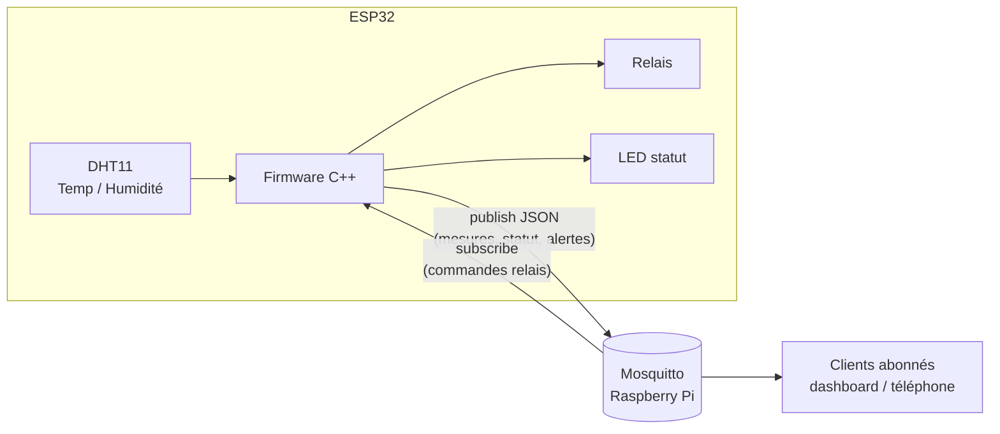

# 🌡️ Station IoT ESP32 — Supervision température & humidité

Station de mesure connectée basée sur un **ESP32** et un capteur **DHT11**, qui publie ses données en **MQTT** vers un broker **Mosquitto** hébergé sur un **Raspberry Pi**. Le firmware gère aussi un relais (pilotable à distance) et une LED de statut.

Projet réalisé dans le cadre du BTS CIEL (Cybersécurité, Informatique et réseaux, Électronique).

## 🏗️ Architecture



- **Mesures** publiées toutes les 30 s (température, humidité)
- **Statut** publié toutes les 60 s (uptime, RSSI WiFi)
- **Alerte** en cas de dépassement du seuil de température
- **Commandes** reçues par abonnement MQTT (pilotage du relais)

## 📡 Topics MQTT

| Topic | Sens | Contenu |
|---|---|---|
| `station/mesures` | ESP32 → broker | JSON `{temp, humidite, device}` |
| `station/statut` | ESP32 → broker | JSON `{uptime, rssi, event}` |
| `station/commande` | broker → ESP32 | Commande relais (`ON` / `OFF`) |

> Adapter les noms de topics dans `config_esp32.h` selon votre installation.

## 🔌 Matériel

- ESP32 DevKit
- Capteur DHT11 (données sur GPIO configurable)
- Module relais 5V
- LED de statut + résistance
- Raspberry Pi (broker Mosquitto)

## ⚙️ Installation

### 1. Broker Mosquitto sur le Raspberry Pi

```bash
sudo apt update && sudo apt install mosquitto mosquitto-clients
sudo systemctl enable mosquitto
```

Vérifier que le broker écoute sur le port 1883 :

```bash
mosquitto_sub -h localhost -t "station/#" -v
```

### 2. Configuration du firmware

Copier le fichier d'exemple et renseigner vos identifiants :

```bash
cp config_esp32.h.example config_esp32.h
```

Puis éditer `config_esp32.h` (SSID WiFi, mot de passe, IP du broker, pins).
⚠️ `config_esp32.h` est ignoré par git : **vos identifiants ne sont jamais publiés**.

### 3. Compilation et flash

Dans l'IDE Arduino :

1. Installer les bibliothèques : `DHT sensor library` (Adafruit), `PubSubClient`, `ArduinoJson`
2. Sélectionner la carte **ESP32 Dev Module**
3. Compiler et téléverser
4. Ouvrir le moniteur série (115200 bauds) pour vérifier la connexion WiFi/MQTT

### 4. Test

```bash
# Sur le Raspberry Pi : écouter les mesures
mosquitto_sub -h localhost -t "station/mesures" -v

# Envoyer une commande au relais
mosquitto_pub -h localhost -t "station/commande" -m "ON"
```

## 🧪 Simulation

Le projet a d'abord été prototypé sur [Wokwi](https://wokwi.com) avant le passage sur matériel réel (câblage breadboard, DHT11 physique).

## 🚀 Pistes d'amélioration

- TLS sur la connexion MQTT (certificats, port 8883)
- Backoff exponentiel sur les reconnexions WiFi/MQTT
- Stockage des mesures côté Raspberry Pi (SQLite) + dashboard web
- OTA (mise à jour du firmware à distance)

## 📄 Licence

MIT
